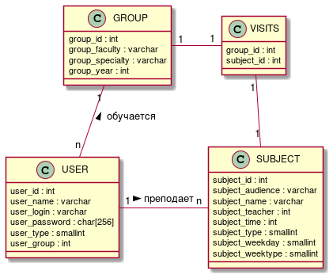

# Timetable for students

> This project was made for my friends who had always forgot their schedule.

## Functionality

This application should be able to:

- [ ] give any user (even non-authorized) to view schedule for any group;
- [ ] give opportunity for the authorized users to view their schedule without
      need to search for specific group every time they open up this app;
- [ ] provide schedule for the teachers;
- [ ] grant access to edit schedules for editor accounts.

## Description

### Database

The database is quite simple. It only has 3 tables and 1 optional table for
_many-many_ relation.
The `USER` table covers different type of users which are:

0. **Student** - the ordinary user. This is the default role when you registered
   for the first time.
1. **Teacher** - this is a teacher. He has an alternative view that shows only
   classes that he has teaches.
2. **Admin/Editor** - has the magic powers to create new subjects and assign them
   to teachers/groups of student.

The `GROUP` table contains information about different specialties. It has
faculty name, specialty name and the year of enrolling.

The `SUBJECT` table contains information about discipline name, audience
number, teacher's ID, date, week type and time when the subject starts. Week
types can be white (0), and green (1).

Here is an UML class diagram for this database:

    
    <label style='display: block'>Fig. 1. Database diagram</label>

### API end-points

> **GET** `/subject`\
> Gets list of subjects using group, teacher's or subject's identifier
> \
> _Query params:_\
> `group` (integer) - ID of the group that should be used to retrieve schedule\
> `teacher` (integer) - ID of the teacher\
> `id` (integer) - ID of the subject to get full information about it\
> `count` (integer) - The number of subjects to return (Defaults to 0, which means all)\
> `offset` (integer) - The offset from the start, to retrieve new subjects (Defaults to 0)

> POST `/subject`\
