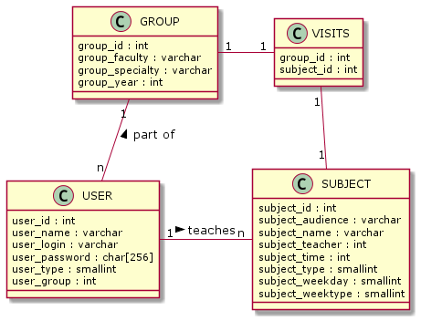

# Timetable for students
This project was made for my friends who had always forgot their schedule.

## Database
The database is quite simple. It only has 3 tables and 1 optional table for
*many-many* relation.
The `USER` table covers different type of users which are:

0. **Student** - the ordinary user. This is the default role when you registered
for the first time.
1. **Teacher** - this is a teacher. He has an alternative view that shows only
classes that he has teaches.
2. **Admin/Editor** - has the magic powers to create new subjects and assign them
to teachers/groups of student.

The `GROUP` table contains information about different specialties. It has
faculty name, specialty name and the year of enrolling.

The `SUBJECT` table contains information about discipline name, audience
number, teacher's ID, date, week type and time when the subject starts. Week
types can be white (0), and green (1).

Here is an UML class diagram for this database:

